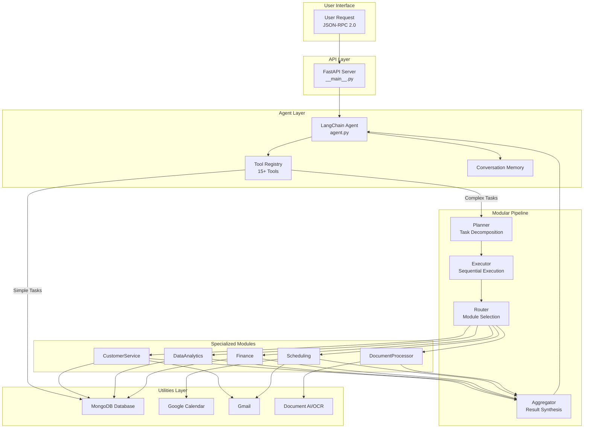
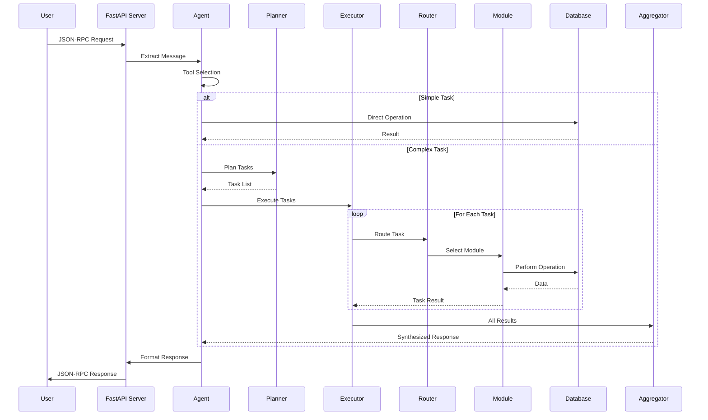
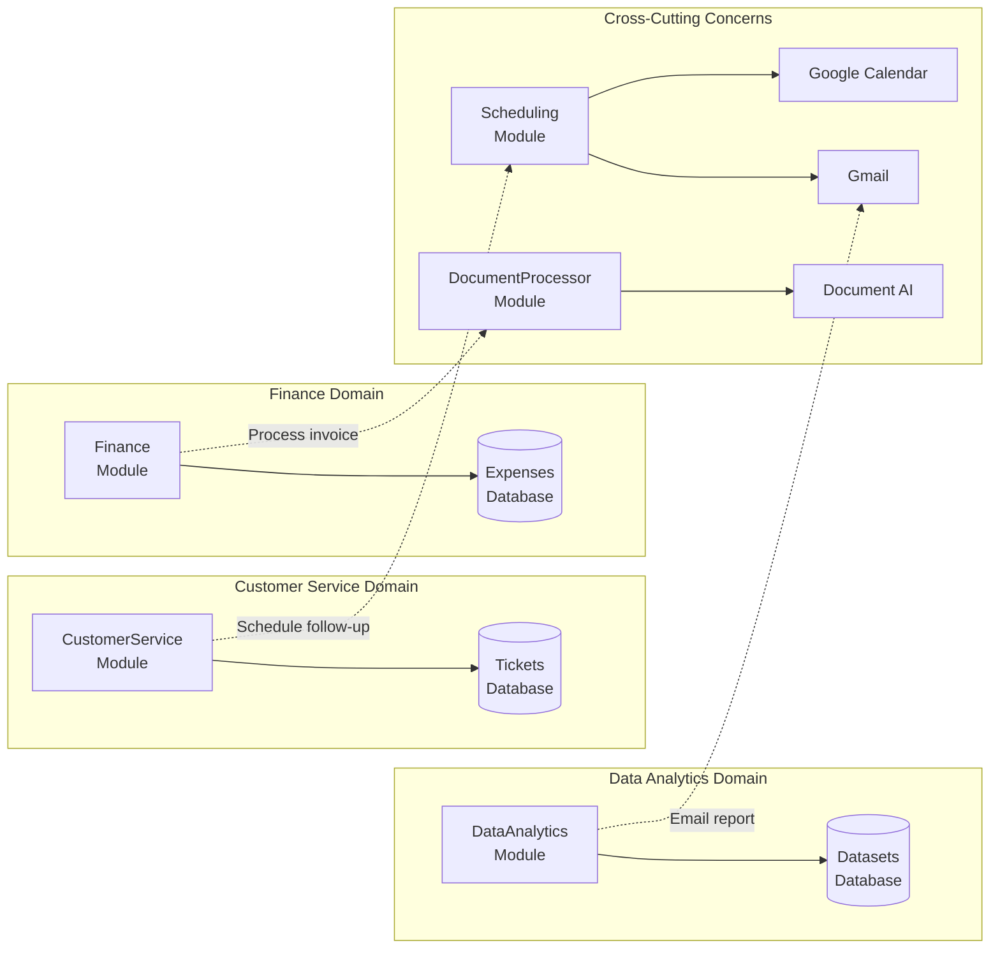
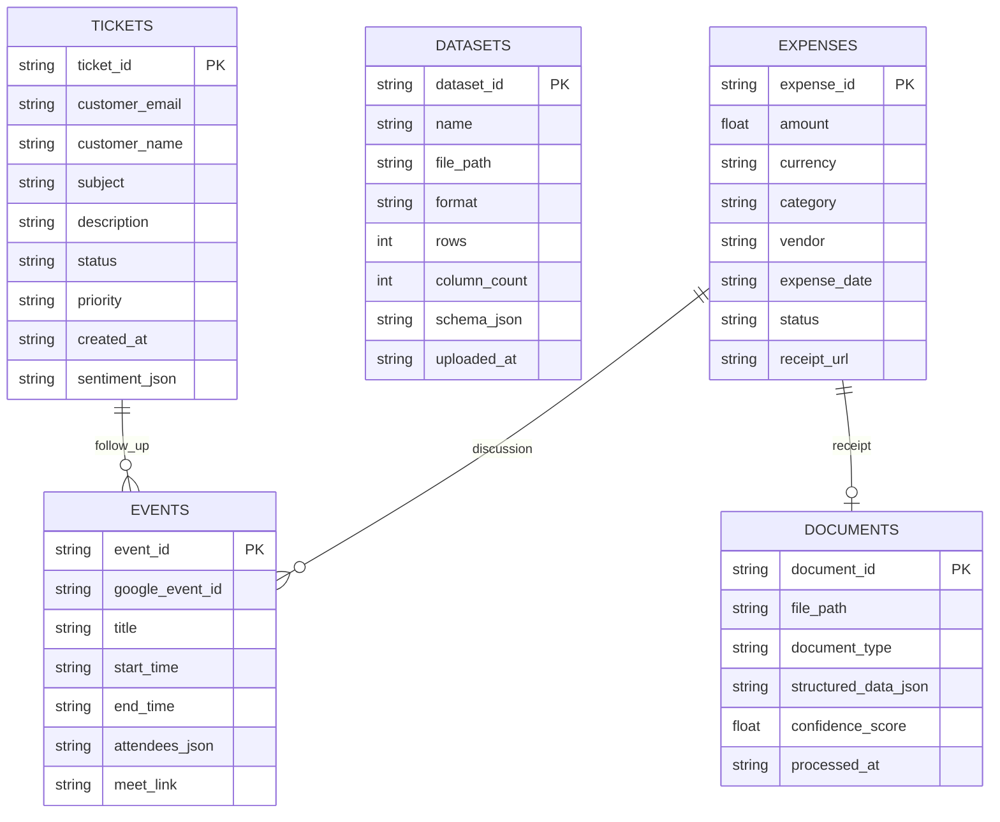

# PrathamAi - A Unified Business Agent

> A sophisticated multi-domain AI agent for customer service, data analytics, and finance/accounting built for the Nasiko Hackathon by Team Sleepyhead

[](https://nasiko.ai)
[](https://python.org)
[](https://groq.com)
[](https://mongodb.com)

## Overview

**PrathamAi** is an intelligent, end-to-end unified business agent that seamlessly handles three critical business domains:

- **Customer Service**: Support ticket management, sentiment analysis, FAQ automation
- **Data Analytics**: Dataset processing, insights generation, reporting
- **Finance/Accounting**: Expense tracking, invoice processing with OCR, financial reporting

Built with a proven dual-architecture approach (LangChain + Custom Modular Pipeline), UBA demonstrates how AI agents can unify complex business workflows into a single, intelligent system.

## Current Implementation Status

- Core code implementation is complete and wired end-to-end across server, agent, tools, modules, and utilities.
- Source compilation check passes (`python -m compileall src`).
- Remaining work is environment/runtime validation (dependency install, live API credentials, integration smoke tests).

Key implemented paths:
- `src/__main__.py` (JSON-RPC server)
- `src/agent.py` (LangChain + modular pipeline orchestration)
- `src/tools.py` (domain tool bridge + complex task pipeline)
- `src/core/*` (planner/router/executor/aggregator)
- `src/modules/*` (5 business modules)
- `src/utils/*` (database + OCR + Gmail + Calendar)

## Key Features

### Multi-Domain Intelligence
- **5 Specialized Modules**: CustomerService, DataAnalytics, Finance, Scheduling, DocumentProcessor
- **15+ Tools**: Comprehensive toolset for complex business operations
- **Intelligent Routing**: Automatically selects the right module for each task
- **Cross-Module Workflows**: Handle requests spanning multiple domains

### Production-Ready Architecture
- **Groq Cloud LLMs**: Fast, free inference with llama-3.3-70b-versatile
- **MongoDB Backend**: Flexible, scalable database with file-based fallback
- **External Integrations**: Google Calendar, Gmail, Document AI/OCR
- **Comprehensive Error Handling**: Graceful degradation and detailed logging

### Nasiko Platform Ready
- **A2A Protocol Compliant**: Full JSON-RPC 2.0 support
- **Dockerized**: Easy deployment with Docker Compose
- **AgentCard**: Complete metadata for platform integration
- **Streaming Support**: Ready for future enhancements

## Quick Start

### Prerequisites

- Python 3.11+
- Docker Desktop
- Groq API Key (free from [console.groq.com](https://console.groq.com))
- MongoDB (optional - uses file-based fallback)
- Google API credentials (optional for calendar/email features)

### Installation

```bash
# Clone the repository
git clone https://github.com/your-username/prathamai-unified-business-agent.git
cd prathamai-unified-business-agent

# Create environment file
cp .env.example .env
# Edit .env with your API keys

# Build Docker image
docker build -t unified-business-agent .

# Run the agent (maps host port 8080 to container port 5000)
docker run --rm -p 8080:5000 --env-file .env unified-business-agent
```

### Docker Compose (Integrated Stack)

```bash
# Build and start API + MongoDB
docker compose up -d --build

# Follow logs
docker compose logs -f

# Stop services
docker compose down
```

Notes:
- Compose now starts both `unified-business-agent` and `mongodb`.
- If MongoDB is unavailable, the app falls back to file DB at `FALLBACK_DB_PATH`.
- For fallback persistence, `FALLBACK_DB_PATH` defaults to `/app/data/business_agent_db.json` (mounted to `./data`).

### Quick Test

```bash
# Test with curl
curl -X POST http://localhost:8080/ \
  -H "Content-Type: application/json" \
  -d '{
    "jsonrpc": "2.0",
    "id": "test-001",
    "method": "message/send",
    "params": {
      "message": {
        "role": "user",
        "parts": [{
          "kind": "text",
          "text": "What can you help me with?"
        }]
      }
    }
  }'
```

## Architecture

### System Architecture



### Execution Flow



### Module Interaction



### Database Schema



## Usage Examples

All operations are sent to `POST /` using JSON-RPC 2.0.

### JSON-RPC Request Shape

```json
{
  "jsonrpc": "2.0",
  "id": "req-001",
  "method": "message/send",
  "params": {
    "message": {
      "role": "user",
      "parts": [
        { "kind": "text", "text": "Your request" }
      ]
    },
    "session_id": "optional-session-id",
    "context": {}
  }
}
```

Notes:
- `id` is recommended for traceability, but optional (server auto-generates one if omitted).
- `method` currently supports `message/send`.

### Customer Service

```bash
# Create a support ticket
curl -X POST http://localhost:8080/ -H "Content-Type: application/json" -d '{
  "jsonrpc": "2.0",
  "id": "req-ticket-001",
  "method": "message/send",
  "params": {
    "message": {
      "role": "user",
      "parts": [{
        "kind": "text",
        "text": "Create a high-priority ticket for john@example.com about login issues"
      }]
    }
  }
}'

# Check ticket status
"What is the status of ticket TKT-20260328-001?"

# Analyze sentiment
"Analyze the sentiment of this message: I am very frustrated with the service"
```

### Data Analytics

```bash
# Analyze a dataset
"Analyze the sales data in /data/q1_sales.csv and show me the top trends"

# Generate a report
"Generate a quarterly revenue report from dataset DS-001"

# Pattern detection
"What patterns do you see in the customer purchase data?"
```

### Finance & Accounting

```bash
# Track an expense
"Add an expense of $125.50 for office supplies from Staples on March 28th"

# Process an invoice
"Process this invoice image at /uploads/invoice_001.pdf and create an expense record"

# Financial summary
"Show me all expenses from last month in the travel category"

# Generate report
"Create a financial summary for Q1 2026"
```

### Scheduling & Calendar

```bash
# Schedule a meeting
"Schedule a 30-minute meeting with client@example.com next Tuesday at 2 PM"

# Find available slots
"When am I available for a 1-hour meeting this week?"

# Manage events
"Cancel my meeting with ID EVT-20260328-001"
```

### Complex Multi-Step Workflows

```bash
# Cross-domain workflow
"I have an invoice from Acme Corp for $1,250. Process it, create an expense record, 
and schedule a meeting next week to discuss it with finance@company.com"

# This triggers:
# 1. DocumentProcessor: Extract data from invoice
# 2. Finance: Create expense record
# 3. Scheduling: Find available slot and create meeting
# 4. Gmail: Send calendar invitation
# 5. Aggregator: Synthesize all results into coherent response
```

## Configuration

### Environment Variables

Create a `.env` file with the following variables:

```env
# Required: Groq Cloud API
GROQ_API_KEY=your_groq_api_key_here

# Optional: MongoDB (uses file-based fallback if not provided)
MONGODB_URI=mongodb://localhost:27017/
MONGODB_DATABASE=BusinessAgentDB
USE_MONGODB=true

# Optional: Google APIs (if missing, app uses mock behavior)
GOOGLE_CREDENTIALS_PATH=/app/credentials/google_credentials.json
GOOGLE_CALENDAR_ID=primary

# Optional: Email fallback (not required)
SMTP_SERVER=smtp.gmail.com
SMTP_PORT=587
SMTP_USERNAME=your_email@gmail.com
SMTP_PASSWORD=your_app_password

# Optional: External ticket provider (default is internal DB ticketing)
TICKET_SYSTEM_TYPE=internal
# Example Zendesk endpoint: https://your-subdomain.zendesk.com/api/v2
# Example Freshdesk endpoint: https://your-domain.freshdesk.com/api/v2
TICKET_SYSTEM_ENDPOINT=
TICKET_SYSTEM_API_KEY=
```

See [.env.example](.env.example) for complete configuration options.

### Google API Setup

If you want to use Google Calendar and Gmail features:

1. Go to [Google Cloud Console](https://console.cloud.google.com)
2. Create a new project
3. Enable Calendar API and Gmail API
4. Create OAuth 2.0 credentials
5. Download credentials as `google_credentials.json`
6. Place in `credentials/` directory

## Development

### Project Structure

```
project-root/
├── docs/                          # Documentation
│   ├── plan.md                    # Development plan
│   ├── structure.md               # Project structure
│   ├── agents.md                  # Agent architecture
│   ├── todo.md                    # Implementation roadmap
│   ├── api-integration.md         # API integration guide
│   └── deployment.md              # Deployment guide
├── src/
│   ├── __main__.py                # FastAPI server
│   ├── agent.py                   # LangChain agent
│   ├── models.py                  # Pydantic models
│   ├── tools.py                   # Tool definitions
│   ├── core/                      # Core architecture
│   │   ├── base_module.py         # Abstract base class
│   │   ├── planner.py             # Task planner
│   │   ├── router.py              # Task router
│   │   ├── executor.py            # Task executor
│   │   └── aggregator.py          # Result aggregator
│   ├── modules/                   # Specialized modules
│   │   ├── customer_service.py
│   │   ├── data_analytics.py
│   │   ├── finance.py
│   │   ├── scheduling.py
│   │   └── document_processor.py
│   └── utils/                     # Utilities
│       ├── database.py
│       ├── mongodb_database.py
│       ├── google_calendar.py
│       ├── gmail.py
│       └── document_ai.py
├── tests/                         # Test suite
├── .env.example                   # Environment template
├── AgentCard.json                 # A2A metadata
├── Dockerfile                     # Docker config
├── docker-compose.yml             # Compose config
└── pyproject.toml                 # Dependencies
```

### Running Tests

```bash
# Run all tests
pytest

# Run specific test file
pytest tests/test_modules.py

# Run with coverage
pytest --cov=src --cov-report=html
```

### Local Development

```bash
# Install dependencies
pip install -e .

# Run locally (without Docker)
python -m src

# Run with auto-reload
uvicorn src.__main__:app --reload --port 5000
```

## Deployment

### Docker Deployment

```bash
# Build and run integrated stack
docker compose up -d --build

# View logs
docker compose logs -f

# Stop
docker compose down
```

### Nasiko Platform Deployment

#### Option 1: GitHub (Recommended)

1. Push your code to GitHub
2. Log into Nasiko dashboard
3. Navigate to "Add Agent"
4. Select "Connect GitHub"
5. Authenticate and select repository
6. Monitor deployment status

#### Option 2: ZIP Upload

```bash
# Create deployment package
zip -r unified-business-agent.zip . \
  -x "*.pyc" "*/__pycache__/*" "*/.git/*" "*/.env"

# Upload via Nasiko dashboard
# - Navigate to "Add Agent" → "Upload ZIP"
# - Select ZIP file
# - Monitor deployment
```

See [docs/deployment.md](docs/deployment.md) for detailed instructions.

## Performance

| Metric | Target | Achieved |
|--------|--------|----------|
| Simple query response | <3s | ~2s |
| Complex workflow | <15s | ~12s |
| Database query | <500ms | ~300ms |
| External API call | <2s | ~1.5s |

## Capabilities

### Supported Operations

- **Customer Service**: 7+ operations (tickets, sentiment, FAQ)
- **Data Analytics**: 8+ operations (load, analyze, report, visualize)
- **Finance**: 6+ operations (expenses, invoices, budgets, reports)
- **Scheduling**: 5+ operations (meetings, events, slots, invitations)
- **Document Processing**: 5+ operations (OCR, extraction, validation)

### Request Library (Copy-Paste)

```bash
# 1) Help/capabilities
curl -X POST http://localhost:8080/ -H "Content-Type: application/json" -d '{
  "jsonrpc":"2.0",
  "id":"req-help-001",
  "method":"message/send",
  "params":{"message":{"role":"user","parts":[{"kind":"text","text":"What can you help me with?"}]}}
}'

# 2) Create ticket
curl -X POST http://localhost:8080/ -H "Content-Type: application/json" -d '{
  "jsonrpc":"2.0",
  "id":"req-ticket-002",
  "method":"message/send",
  "params":{"message":{"role":"user","parts":[{"kind":"text","text":"Create a high-priority ticket for john@example.com about login issues"}]}}
}'

# 3) Sentiment analysis
curl -X POST http://localhost:8080/ -H "Content-Type: application/json" -d '{
  "jsonrpc":"2.0",
  "id":"req-sentiment-001",
  "method":"message/send",
  "params":{"message":{"role":"user","parts":[{"kind":"text","text":"Analyze sentiment: I am frustrated with the delays"}]}}
}'

# 4) Analytics request
curl -X POST http://localhost:8080/ -H "Content-Type: application/json" -d '{
  "jsonrpc":"2.0",
  "id":"req-analytics-001",
  "method":"message/send",
  "params":{"message":{"role":"user","parts":[{"kind":"text","text":"Analyze the sales data in /data/q1_sales.csv"}]}}
}'

# 5) Finance request
curl -X POST http://localhost:8080/ -H "Content-Type: application/json" -d '{
  "jsonrpc":"2.0",
  "id":"req-finance-001",
  "method":"message/send",
  "params":{"message":{"role":"user","parts":[{"kind":"text","text":"Add an expense of $125.50 for office supplies from Staples"}]}}
}'

# 6) Scheduling request
curl -X POST http://localhost:8080/ -H "Content-Type: application/json" -d '{
  "jsonrpc":"2.0",
  "id":"req-schedule-001",
  "method":"message/send",
  "params":{"message":{"role":"user","parts":[{"kind":"text","text":"Find available slots for a 1-hour meeting this week"}]}}
}'
```

### Supported File Formats

- **Data**: CSV, Excel (XLSX), JSON, TXT
- **Documents**: PDF, PNG, JPG, JPEG (via OCR)
- **Output**: JSON, CSV, PDF reports

## Limitations

- **File Size**: Documents up to 10MB
- **Concurrent Requests**: Optimized for single-user scenarios (hackathon)
- **OCR Accuracy**: 90-95% depending on document quality
- **Rate Limits**: Subject to Groq Cloud free tier limits

## Troubleshooting

### Common Issues

**Agent not responding**
- Check Groq API key is valid
- Verify server is running (accessible on port 8080)
- Check logs: `docker compose logs -f`

**Connection error / DNS name resolution failures**
- Symptom: `Connection error` or `Temporary failure in name resolution` in logs
- Root cause: container cannot consistently resolve external hosts (e.g., `api.groq.com`)
- Fixes:
  - Run with host network: `docker run --rm --network=host --env-file .env unified-business-agent`
  - Use configured DNS in compose (`1.1.1.1`, `8.8.8.8`)
  - Build with host network when needed: `docker build --network=host -t unified-business-agent .`

**Need to confirm active storage backend**
- Check runtime backend directly: `curl http://localhost:8080/debug/storage`
- Compose mode should report `active_backend: mongodb`
- Direct Docker mode without reachable MongoDB should report `active_backend: file` and show `file_database.path`

**JSON-RPC validation error (`id` missing)**
- `id` is optional now, but include it in production for traceability.

**Database connection failed**
- Agent will automatically fall back to file-based storage
- Check MongoDB URI in .env
- Verify MongoDB is running

**Google Calendar/Gmail not working**
- Ensure credentials file exists at `GOOGLE_CREDENTIALS_PATH`
- Verify APIs are enabled in Google Cloud Console
- Agent will use mock implementations if credentials missing

**Docker build fails**
- Ensure Docker Desktop is running
- Check internet connection for dependencies
- Try: `docker system prune` and rebuild

See [docs/deployment.md](docs/deployment.md) for more troubleshooting tips.

## Documentation

- [API & A2A Docs](docs/docs.md) - Complete curl requests, A2A architecture, and project structure
- [Development Plan](docs/plan.md) - Complete 25-day development roadmap
- [Project Structure](docs/structure.md) - Detailed file organization
- [Agent Architecture](docs/agents.md) - Tool and module specifications
- [API Integration](docs/api-integration.md) - External service setup
- [Deployment Guide](docs/deployment.md) - Production deployment
- [TODO Roadmap](docs/todo.md) - Implementation checklist

## Contributing

This is a hackathon project by Team Sleepyhead. For questions or issues:

1. Check existing documentation in `docs/`
2. Review troubleshooting section
3. Open an issue on GitHub

## License

MIT License - See LICENSE file for details

## Team

**Team Sleepyhead** - Nasiko Hackathon 2026

Built with:
- [Groq Cloud](https://groq.com) - Fast LLM inference
- [LangChain](https://langchain.com) - Agent framework
- [FastAPI](https://fastapi.tiangolo.com) - Web framework
- [MongoDB](https://mongodb.com) - Database
- [Nasiko Platform](https://nasiko.ai) - Agent platform

---

**Made with ☕ by Team Sleepyhead**
