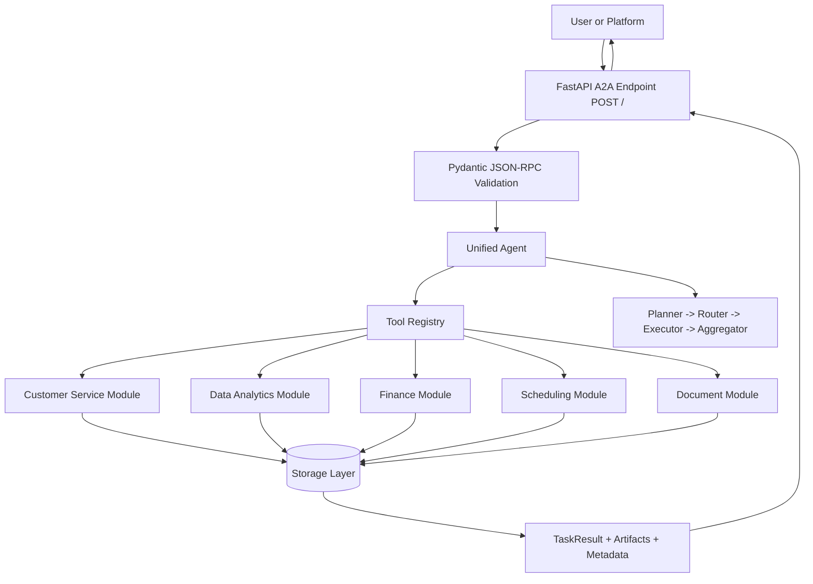

# Unified Business Agent - API and Architecture Docs

This document provides complete curl request examples, A2A architecture, and project structure aligned with the reference style in `resources/HACKATHON_AGENT_GUIDE.md` and `resources/customize.md`.

## Table of Contents

1. Getting Started
   - Prerequisites
   - Runtime Modes
   - Running the Agent
2. Understanding the A2A Protocol
   - JSON-RPC 2.0 Request Shape
   - JSON-RPC 2.0 Success Response Shape
3. Complete curl Request Library
   - Service Endpoints
   - Core A2A Requests
   - Customer Service Requests
   - Data Analytics Requests
   - Finance Requests
   - Scheduling Requests
   - Document Requests
   - Error and Validation Requests
4. Persistence and Storage Verification
5. A2A Architecture
6. Project Structure
7. Customization Checklist (Guide-Aligned)
8. Troubleshooting

---

## Getting Started

### Prerequisites

- Python 3.11+
- Docker (for recommended runtime)
- Groq API key (`GROQ_API_KEY`)
- MongoDB Atlas URI (default path in this project)

### Runtime Modes

This project supports two storage modes:

1. **MongoDB mode** (preferred): writes to MongoDB when reachable.
2. **Fallback file mode**: if MongoDB is unreachable, writes continue to local file DB.

Fallback is enabled by design. All responses now include storage metadata so you can see where data was written.

### Running the Agent

**Option 1: Docker (Recommended)**

```bash
# Build the image
docker build -t unified-business-agent .

# Run the container (maps host port 8080 to container port 5000)
docker run -d --name uba-test --env-file .env -p 8080:5000 unified-business-agent

# Check logs
docker logs -f uba-test

# Check health
curl http://localhost:8080/health

# Stop and remove
docker stop uba-test && docker rm uba-test
```

**Option 2: Docker Compose**

```bash
# Start all services (agent + MongoDB)
docker compose up -d --build

# Follow logs
docker compose logs -f

# Stop services
docker compose down
```

**Option 3: Local Development**

```bash
# Install dependencies
pip install -r requirements.txt

# Run with Python
python -m src

# Or run with auto-reload
uvicorn src.__main__:app --reload --port 5000
```

Note: When running locally without Docker, the agent runs on port 5000. When running in Docker, map host port 8080 to container port 5000.

---

## Understanding the A2A Protocol

The server uses A2A over JSON-RPC 2.0.

### JSON-RPC 2.0 Request Shape

```json
{
  "jsonrpc": "2.0",
  "id": "req-001",
  "method": "message/send",
  "params": {
    "session_id": "optional-session-id",
    "context": {},
    "message": {
      "role": "user",
      "parts": [
        {
          "kind": "text",
          "text": "Create a high-priority ticket for john@example.com about login issues"
        }
      ]
    }
  }
}
```

### JSON-RPC 2.0 Success Response Shape

```json
{
  "jsonrpc": "2.0",
  "id": "req-001",
  "result": {
    "id": "task-id",
    "kind": "task",
    "status": {
      "state": "completed",
      "timestamp": "2026-03-29T09:23:34.682897Z",
      "error": null,
      "progress": null
    },
    "artifacts": [
      {
        "artifactId": "artifact-id",
        "parts": [
          {
            "kind": "text",
            "text": "Ticket created successfully. ID: TICKET-1007. Priority: high. Customer: john@example.com. Storage backend: file."
          }
        ],
        "metadata": {
          "storage": {
            "active_backend": "file",
            "connected": true
          }
        }
      }
    ],
    "history": [],
    "contextId": "context-id",
    "sessionId": "session-id",
    "metadata": {
      "storage": {
        "active_backend": "file",
        "connected": true
      }
    }
  }
}
```

---

## Complete curl Request Library

All RPC requests go to `POST http://localhost:8080/`.

### Service Endpoints

```bash
# Root service info
curl -X GET http://localhost:8080/

# Health
curl -X GET http://localhost:8080/health

# Active storage backend details
curl -X GET http://localhost:8080/debug/storage
```

### Core A2A Requests

```bash
# Capabilities
curl -X POST http://localhost:8080/ -H "Content-Type: application/json" -d '{
  "jsonrpc": "2.0",
  "id": "req-help-001",
  "method": "message/send",
  "params": {
    "message": {
      "role": "user",
      "parts": [{"kind": "text", "text": "What can you help me with?"}]
    }
  }
}'

# Generic session-aware request
curl -X POST http://localhost:8080/ -H "Content-Type: application/json" -d '{
  "jsonrpc": "2.0",
  "id": "req-core-001",
  "method": "message/send",
  "params": {
    "session_id": "session-demo-001",
    "context": {"source": "curl-docs"},
    "message": {
      "role": "user",
      "parts": [{"kind": "text", "text": "Summarize what you can do in one sentence."}]
    }
  }
}'
```

### Customer Service Requests

```bash
# Create support ticket (deterministic pattern)
curl -X POST http://localhost:8080/ -H "Content-Type: application/json" -d '{
  "jsonrpc": "2.0",
  "id": "req-ticket-001",
  "method": "message/send",
  "params": {
    "message": {
      "role": "user",
      "parts": [{
        "kind": "text",
        "text": "Create a high-priority ticket for john@example.com about login issues"
      }]
    }
  }
}'

# Ticket status request
curl -X POST http://localhost:8080/ -H "Content-Type: application/json" -d '{
  "jsonrpc": "2.0",
  "id": "req-ticket-status-001",
  "method": "message/send",
  "params": {
    "message": {
      "role": "user",
      "parts": [{"kind": "text", "text": "Get ticket status for TICKET-1007"}]
    }
  }
}'

# Sentiment analysis
curl -X POST http://localhost:8080/ -H "Content-Type: application/json" -d '{
  "jsonrpc": "2.0",
  "id": "req-sentiment-001",
  "method": "message/send",
  "params": {
    "message": {
      "role": "user",
      "parts": [{"kind": "text", "text": "Analyze the sentiment: I am frustrated with delayed support"}]
    }
  }
}'

# FAQ request
curl -X POST http://localhost:8080/ -H "Content-Type: application/json" -d '{
  "jsonrpc": "2.0",
  "id": "req-faq-001",
  "method": "message/send",
  "params": {
    "message": {
      "role": "user",
      "parts": [{"kind": "text", "text": "How do I contact support?"}]
    }
  }
}'
```

### Data Analytics Requests

```bash
# Analyze dataset
curl -X POST http://localhost:8080/ -H "Content-Type: application/json" -d '{
  "jsonrpc": "2.0",
  "id": "req-analytics-001",
  "method": "message/send",
  "params": {
    "message": {
      "role": "user",
      "parts": [{"kind": "text", "text": "Analyze the sales data in /data/q1_sales.csv"}]
    }
  }
}'

# Generate report
curl -X POST http://localhost:8080/ -H "Content-Type: application/json" -d '{
  "jsonrpc": "2.0",
  "id": "req-report-001",
  "method": "message/send",
  "params": {
    "message": {
      "role": "user",
      "parts": [{"kind": "text", "text": "Generate a quarterly report from dataset DS-001"}]
    }
  }
}'
```

### Finance Requests

```bash
# Add expense
curl -X POST http://localhost:8080/ -H "Content-Type: application/json" -d '{
  "jsonrpc": "2.0",
  "id": "req-finance-001",
  "method": "message/send",
  "params": {
    "message": {
      "role": "user",
      "parts": [{"kind": "text", "text": "Add an expense of $125.50 for office supplies from Staples"}]
    }
  }
}'

# Budget check
curl -X POST http://localhost:8080/ -H "Content-Type: application/json" -d '{
  "jsonrpc": "2.0",
  "id": "req-budget-001",
  "method": "message/send",
  "params": {
    "message": {
      "role": "user",
      "parts": [{"kind": "text", "text": "Check my monthly budget for office expenses"}]
    }
  }
}'
```

### Scheduling Requests

```bash
# Schedule a meeting
curl -X POST http://localhost:8080/ -H "Content-Type: application/json" -d '{
  "jsonrpc": "2.0",
  "id": "req-schedule-001",
  "method": "message/send",
  "params": {
    "message": {
      "role": "user",
      "parts": [{"kind": "text", "text": "Schedule a 30-minute meeting with client@example.com next Tuesday at 2 PM"}]
    }
  }
}'

# Find available slots
curl -X POST http://localhost:8080/ -H "Content-Type: application/json" -d '{
  "jsonrpc": "2.0",
  "id": "req-slots-001",
  "method": "message/send",
  "params": {
    "message": {
      "role": "user",
      "parts": [{"kind": "text", "text": "Find available slots for a 1-hour meeting this week"}]
    }
  }
}'
```

### Document Requests

```bash
# Process invoice document
curl -X POST http://localhost:8080/ -H "Content-Type: application/json" -d '{
  "jsonrpc": "2.0",
  "id": "req-doc-001",
  "method": "message/send",
  "params": {
    "message": {
      "role": "user",
      "parts": [{"kind": "text", "text": "Process invoice /data/invoices/invoice_001.pdf and extract totals"}]
    }
  }
}'
```

### Error and Validation Requests

```bash
# Unknown method (method not found)
curl -X POST http://localhost:8080/ -H "Content-Type: application/json" -d '{
  "jsonrpc": "2.0",
  "id": "req-error-001",
  "method": "unknown/method",
  "params": {
    "message": {
      "role": "user",
      "parts": [{"kind": "text", "text": "hello"}]
    }
  }
}'

# Empty message (invalid request)
curl -X POST http://localhost:8080/ -H "Content-Type: application/json" -d '{
  "jsonrpc": "2.0",
  "id": "req-error-002",
  "method": "message/send",
  "params": {
    "message": {
      "role": "user",
      "parts": [{"kind": "text", "text": ""}]
    }
  }
}'
```

---

## Persistence and Storage Verification

### 1) Check active backend

```bash
curl -X GET http://localhost:8080/debug/storage
```

Expected important fields:

- `storage.active_backend`: `mongodb` or `file`
- `storage.connected`: boolean

### 2) Create a ticket

Use `req-ticket-001` example above.

### 3) Verify backend used for that request

Check both of these in the response:

- `result.metadata.storage.active_backend`
- `result.artifacts[0].metadata.storage.active_backend`

### 4) Verify data in fallback file (when backend is file)

If running in container and fallback path is `/tmp/business_agent_db.json`:

```bash
docker exec -it <container_name> sh -lc 'python - <<"PY"
import json
from pathlib import Path
p = Path("/tmp/business_agent_db.json")
print("exists:", p.exists())
if p.exists():
    data = json.loads(p.read_text())
    print("tickets:", len(data.get("tickets", {})))
    print("latest:", list(data.get("tickets", {}).keys())[-1] if data.get("tickets") else None)
PY'
```

### 5) Verify data in MongoDB Atlas (when backend is mongodb)

Use your Mongo shell or MongoDB Compass for database `MONGODB_DATABASE` and collection `tickets`.

---

## A2A Architecture

This architecture follows the guide style: request intake, agent logic, tool execution, module orchestration, response synthesis.



Storage layer behavior:

- Primary: MongoDB (`MONGODB_URI`, `USE_MONGODB=true`)
- Fallback: file DB (`FALLBACK_DB_PATH`) when MongoDB is unreachable
- Visibility: active backend returned in response metadata

---

## Project Structure

Guide-aligned structure for this repository:

```text
NasikoAlphaAgent-Submission/
|-- docs/
|   |-- docs.md
|   |-- plan.md
|   |-- structure.md
|   |-- todo.md
|   `-- PROGRESS.md
|-- resources/
|   |-- HACKATHON_AGENT_GUIDE.md
|   `-- customize.md
|-- src/
|   |-- __main__.py
|   |-- agent.py
|   |-- models.py
|   |-- tools.py
|   |-- core/
|   |   |-- base_module.py
|   |   |-- planner.py
|   |   |-- router.py
|   |   |-- executor.py
|   |   `-- aggregator.py
|   |-- modules/
|   |   |-- customer_service.py
|   |   |-- data_analytics.py
|   |   |-- finance.py
|   |   |-- scheduling.py
|   |   `-- document_processor.py
|   `-- utils/
|       |-- database.py
|       |-- mongodb_database.py
|       |-- google_calendar.py
|       |-- gmail.py
|       `-- document_ai.py
|-- tests/
|-- Dockerfile
|-- docker-compose.yml
|-- pyproject.toml
|-- .env.example
|-- AgentCard.json
`-- README.md
```

---

## Customization Checklist (Guide-Aligned)

Use this as a quick alignment pass with `resources/customize.md`:

- Basic Information
  - Agent name and description are set and consistent across `README.md` and `AgentCard.json`.
- Skills and Capabilities
  - Agent capabilities described in user-facing docs and examples.
- Toolset Configuration
  - Tool registration and modular wiring are active in `src/agent.py` and `src/tools.py`.
- Implementation
  - System prompt and module behavior are implemented.
  - Storage mode and fallback are explicit and observable.
- Testing
  - Validate `/health`, `/debug/storage`, and at least one request per domain.

---

## Troubleshooting

### Ticket created but not visible in Atlas

Possible cause: fallback file DB was used.

Checks:

1. `GET /debug/storage` to confirm active backend.
2. Inspect response metadata for storage backend.
3. Check container logs for MongoDB DNS/timeout errors.

### `GET /debug/storage` returns 404

Possible cause: running an older image.

Fix:

```bash
docker build -t unified-business-agent .
docker run --rm -p 8080:5000 --env-file .env unified-business-agent
```

### Fallback file path differs from docs

Your runtime value comes from `FALLBACK_DB_PATH` environment variable. Check with `/debug/storage`.
