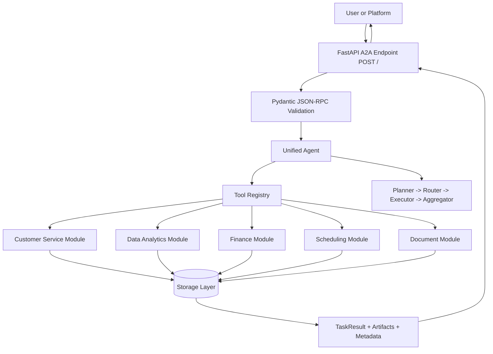

# Unified Business Agent - API and Architecture Docs

This document provides complete curl request examples, A2A architecture, and project structure aligned with the reference style in `resources/HACKATHON_AGENT_GUIDE.md` and `resources/customize.md`.

## Table of Contents

1. Getting Started
   - Prerequisites
   - Runtime Modes
   - Running the Agent
2. Understanding the A2A Protocol
   - JSON-RPC 2.0 Request Shape
   - JSON-RPC 2.0 Success Response Shape
3. Complete curl Request Library
   - Service Endpoints
   - Core A2A Requests
   - Customer Service Requests
   - Data Analytics Requests
   - Finance Requests
   - Scheduling Requests
   - Document Requests
   - Error and Validation Requests
4. Persistence and Storage Verification
5. A2A Architecture
6. Project Structure
7. Customization Checklist (Guide-Aligned)
8. Troubleshooting

---

## Getting Started

### Prerequisites

- Python 3.11+
- Docker (for recommended runtime)
- Groq API key (`GROQ_API_KEY`)
- MongoDB Atlas URI (default path in this project)

### Runtime Modes

This project supports two storage modes:

1. **MongoDB mode** (preferred): writes to MongoDB when reachable.
2. **Fallback file mode**: if MongoDB is unreachable, writes continue to local file DB.

Fallback is enabled by design. All responses now include storage metadata so you can see where data was written.

### Running the Agent

**Option 1: Docker with Host Networking (Recommended)**

This avoids DNS resolution issues and allows MongoDB Atlas connectivity.

```bash
# Build the image (use --network=host if DNS issues occur during build)
docker build --network=host -t unified-business-agent .

# Run with host networking (app accessible on localhost:5000)
docker run -d --name uba-prod --network=host --env-file .env unified-business-agent

# Check logs
docker logs -f uba-prod

# Check health
curl http://localhost:5000/health

# Check storage backend
curl http://localhost:5000/debug/storage

# Stop and remove
docker stop uba-prod && docker rm uba-prod
```

**Option 2: Docker with Port Mapping (Alternative)**

Use this if host networking is not available in your environment. May experience DNS issues.

```bash
# Build the image
docker build -t unified-business-agent .

# Run with port mapping (host:5000 -> container:5000)
docker run -d --name uba-test --env-file .env -p 5000:5000 unified-business-agent

# Access on localhost:5000
curl http://localhost:5000/health
```

**Option 3: Docker Compose**

```bash
# Start all services (agent + MongoDB)
docker compose up -d --build

# Follow logs
docker compose logs -f

# Stop services
docker compose down
```

**Option 4: Local Development**

```bash
# Install dependencies
pip install -r requirements.txt

# Run with Python
python -m src

# Or run with auto-reload
uvicorn src.__main__:app --reload --port 5000
```

**Port Summary**:
- **Host networking** (`--network=host`): Access on `localhost:5000`
- **Port mapping** (`-p 5000:5000`): Access on `localhost:5000`
- **Docker Compose**: Access on `localhost:5000` (configured in docker-compose.yml)
- **Local development**: Access on `localhost:5000`

---

## Understanding the A2A Protocol

The server uses A2A over JSON-RPC 2.0.

### JSON-RPC 2.0 Request Shape

```json
{
  "jsonrpc": "2.0",
  "id": "req-001",
  "method": "message/send",
  "params": {
    "session_id": "optional-session-id",
    "context": {},
    "message": {
      "role": "user",
      "parts": [
        {
          "kind": "text",
          "text": "Create a high-priority ticket for john@example.com about login issues"
        }
      ]
    }
  }
}
```

### JSON-RPC 2.0 Success Response Shape

```json
{
  "jsonrpc": "2.0",
  "id": "req-001",
  "result": {
    "id": "task-id",
    "kind": "task",
    "status": {
      "state": "completed",
      "timestamp": "2026-03-29T09:23:34.682897Z",
      "error": null,
      "progress": null
    },
    "artifacts": [
      {
        "artifactId": "artifact-id",
        "parts": [
          {
            "kind": "text",
            "text": "Ticket created successfully. ID: TICKET-1007. Priority: high. Customer: john@example.com. Storage backend: file."
          }
        ],
        "metadata": {
          "storage": {
            "active_backend": "file",
            "connected": true
          }
        }
      }
    ],
    "history": [],
    "contextId": "context-id",
    "sessionId": "session-id",
    "metadata": {
      "storage": {
        "active_backend": "file",
        "connected": true
      }
    }
  }
}
```

---

## Complete curl Request Library

All RPC requests go to `POST http://localhost:5000/`.

### Service Endpoints

#### Chunk 1: Root Service Info

```bash
curl -X GET http://localhost:5000/
```

Sample response:

```json
{
  "name": "Unified Business Agent",
  "version": "1.0.0",
  "transport": "jsonrpc",
  "endpoint": "/"
}
```

#### Chunk 2: Health Check

```bash
curl -X GET http://localhost:5000/health
```

Sample response:

```json
{
  "status": "healthy",
  "service": "prathamai-agent",
  "agent_initialized": true,
  "timestamp": "2026-03-29T11:18:52.856933"
}
```

#### Chunk 3: Active Storage Backend

```bash
curl -X GET http://localhost:5000/debug/storage
```

Sample response:

```json
{
  "status": "ok",
  "storage": {
    "active_backend": "mongodb",
    "connected": true,
    "config": {
      "use_mongodb": true,
      "mongodb_uri_set": true,
      "fallback_db_path": "/tmp/business_agent_db.json"
    }
  }
}
```

### Core A2A Requests

#### Chunk 4: Capabilities Request

```bash
curl -X POST http://localhost:5000/ -H "Content-Type: application/json" -d '{
  "jsonrpc": "2.0",
  "id": "req-help-001",
  "method": "message/send",
  "params": {
    "message": {
      "role": "user",
      "parts": [{"kind": "text", "text": "What can you help me with?"}]
    }
  }
}'
```

Sample response:

```json
{
  "jsonrpc": "2.0",
  "id": "req-help-001",
  "result": {
    "status": {"state": "completed"},
    "artifacts": [{"parts": [{"kind": "text", "text": "I can help with customer support, analytics, finance, scheduling, and document processing."}]}],
    "metadata": {"storage": {"active_backend": "mongodb", "connected": true}}
  }
}
```

#### Chunk 5: Session-Aware Request

```bash

curl -X POST http://localhost:5000/ -H "Content-Type: application/json" -d '{
  "jsonrpc": "2.0",
  "id": "req-core-001",
  "method": "message/send",
  "params": {
    "session_id": "session-demo-001",
    "context": {"source": "curl-docs"},
    "message": {
      "role": "user",
      "parts": [{"kind": "text", "text": "Summarize what you can do in one sentence."}]
    }
  }
}'
```

Sample response:

```json
{
  "jsonrpc": "2.0",
  "id": "req-core-001",
  "result": {
    "status": {"state": "completed"},
    "sessionId": "session-demo-001",
    "artifacts": [{"parts": [{"kind": "text", "text": "I can manage support tickets, analyze data, track expenses, schedule events, and process documents."}]}],
    "metadata": {"storage": {"active_backend": "mongodb", "connected": true}}
  }
}
```

### Customer Service Requests

#### Chunk 6: Create Support Ticket

```bash
curl -X POST http://localhost:5000/ -H "Content-Type: application/json" -d '{
  "jsonrpc": "2.0",
  "id": "req-ticket-001",
  "method": "message/send",
  "params": {
    "message": {
      "role": "user",
      "parts": [{
        "kind": "text",
        "text": "Create a high-priority ticket for john@example.com about login issues"
      }]
    }
  }
}'
```

Sample response:

```json
{
  "jsonrpc": "2.0",
  "id": "req-ticket-001",
  "result": {
    "status": {"state": "completed"},
    "artifacts": [{"parts": [{"kind": "text", "text": "Ticket created successfully. ID: TICKET-1007. Priority: high. Customer: john@example.com. Storage backend: mongodb."}], "metadata": {"storage": {"active_backend": "mongodb", "connected": true}}}],
    "metadata": {"storage": {"active_backend": "mongodb", "connected": true}}
  }
}
```

#### Chunk 7: Ticket Status Request

```bash

curl -X POST http://localhost:5000/ -H "Content-Type: application/json" -d '{
  "jsonrpc": "2.0",
  "id": "req-ticket-status-001",
  "method": "message/send",
  "params": {
    "message": {
      "role": "user",
      "parts": [{"kind": "text", "text": "Get ticket status for TICKET-1007"}]
    }
  }
}'
```

Sample response:

```json
{
  "jsonrpc": "2.0",
  "id": "req-ticket-status-001",
  "result": {
    "status": {"state": "completed"},
    "artifacts": [{"parts": [{"kind": "text", "text": "Ticket TICKET-1007 is currently open and assigned to customer support queue."}]}],
    "metadata": {"storage": {"active_backend": "mongodb", "connected": true}}
  }
}
```

#### Chunk 8: Sentiment Analysis

```bash

curl -X POST http://localhost:5000/ -H "Content-Type: application/json" -d '{
  "jsonrpc": "2.0",
  "id": "req-sentiment-001",
  "method": "message/send",
  "params": {
    "message": {
      "role": "user",
      "parts": [{"kind": "text", "text": "Analyze the sentiment: I am frustrated with delayed support"}]
    }
  }
}'
```

Sample success response:

```json
{
  "jsonrpc": "2.0",
  "id": "req-sentiment-001",
  "result": {
    "status": {"state": "completed"},
    "artifacts": [{"parts": [{"kind": "text", "text": "Sentiment: negative. Confidence: high. Key signal: frustration with delayed support."}]}],
    "metadata": {"storage": {"active_backend": "mongodb", "connected": true}}
  }
}
```

Sample rate-limit response (common during initial tests):

```json
{
  "jsonrpc": "2.0",
  "id": "req-sentiment-001",
  "result": {
    "status": {"state": "completed"},
    "artifacts": [{"parts": [{"kind": "text", "text": "I apologize, but I encountered an error processing your request: Error code: 429 ... rate_limit_exceeded ... Please try again in a few seconds."}]}],
    "metadata": {"storage": {"active_backend": "mongodb", "connected": true}}
  }
}
```

#### Chunk 9: FAQ Request

```bash

curl -X POST http://localhost:5000/ -H "Content-Type: application/json" -d '{
  "jsonrpc": "2.0",
  "id": "req-faq-001",
  "method": "message/send",
  "params": {
    "message": {
      "role": "user",
      "parts": [{"kind": "text", "text": "How do I contact support?"}]
    }
  }
}'
```

Sample response:

```json
{
  "jsonrpc": "2.0",
  "id": "req-faq-001",
  "result": {
    "status": {"state": "completed"},
    "artifacts": [{"parts": [{"kind": "text", "text": "You can contact support via email at support@business.local or create a ticket through this agent."}]}],
    "metadata": {"storage": {"active_backend": "mongodb", "connected": true}}
  }
}
```

### Data Analytics Requests

#### Chunk 10: Analyze Dataset

```bash
curl -X POST http://localhost:5000/ -H "Content-Type: application/json" -d '{
  "jsonrpc": "2.0",
  "id": "req-analytics-001",
  "method": "message/send",
  "params": {
    "message": {
      "role": "user",
      "parts": [{"kind": "text", "text": "Analyze the sales data in /data/q1_sales.csv"}]
    }
  }
}'
```

Sample response:

```json
{
  "jsonrpc": "2.0",
  "id": "req-analytics-001",
  "result": {
    "status": {"state": "completed"},
    "artifacts": [{"parts": [{"kind": "text", "text": "Dataset analysis complete. Rows: 12,431. Columns: 9. Top trend: Q1 growth in online sales."}]}],
    "metadata": {"storage": {"active_backend": "mongodb", "connected": true}}
  }
}
```

#### Chunk 11: Generate Report

```bash

curl -X POST http://localhost:5000/ -H "Content-Type: application/json" -d '{
  "jsonrpc": "2.0",
  "id": "req-report-001",
  "method": "message/send",
  "params": {
    "message": {
      "role": "user",
      "parts": [{"kind": "text", "text": "Generate a quarterly report from dataset DS-001"}]
    }
  }
}'
```

Sample response:

```json
{
  "jsonrpc": "2.0",
  "id": "req-report-001",
  "result": {
    "status": {"state": "completed"},
    "artifacts": [{"parts": [{"kind": "text", "text": "Quarterly report generated for DS-001. File saved to /data/reports/quarterly_report_DS-001.pdf"}]}],
    "metadata": {"storage": {"active_backend": "mongodb", "connected": true}}
  }
}
```

### Finance Requests

#### Chunk 12: Add Expense

```bash
curl -X POST http://localhost:5000/ -H "Content-Type: application/json" -d '{
  "jsonrpc": "2.0",
  "id": "req-finance-001",
  "method": "message/send",
  "params": {
    "message": {
      "role": "user",
      "parts": [{"kind": "text", "text": "Add an expense of $125.50 for office supplies from Staples"}]
    }
  }
}'
```

Sample response:

```json
{
  "jsonrpc": "2.0",
  "id": "req-finance-001",
  "result": {
    "status": {"state": "completed"},
    "artifacts": [{"parts": [{"kind": "text", "text": "Expense added successfully. ID: EXP-1003. Amount: $125.50. Vendor: Staples."}]}],
    "metadata": {"storage": {"active_backend": "mongodb", "connected": true}}
  }
}
```

#### Chunk 13: Budget Check

```bash

curl -X POST http://localhost:5000/ -H "Content-Type: application/json" -d '{
  "jsonrpc": "2.0",
  "id": "req-budget-001",
  "method": "message/send",
  "params": {
    "message": {
      "role": "user",
      "parts": [{"kind": "text", "text": "Check my monthly budget for office expenses"}]
    }
  }
}'
```

Sample response:

```json
{
  "jsonrpc": "2.0",
  "id": "req-budget-001",
  "result": {
    "status": {"state": "completed"},
    "artifacts": [{"parts": [{"kind": "text", "text": "Monthly office budget status: used 62%, remaining 38%. Current spend: $3,120 / $5,000."}]}],
    "metadata": {"storage": {"active_backend": "mongodb", "connected": true}}
  }
}
```

### Scheduling Requests

#### Chunk 14: Schedule a Meeting

```bash
curl -X POST http://localhost:5000/ -H "Content-Type: application/json" -d '{
  "jsonrpc": "2.0",
  "id": "req-schedule-001",
  "method": "message/send",
  "params": {
    "message": {
      "role": "user",
      "parts": [{"kind": "text", "text": "Schedule a 30-minute meeting with client@example.com next Tuesday at 2 PM"}]
    }
  }
}'
```

Sample response:

```json
{
  "jsonrpc": "2.0",
  "id": "req-schedule-001",
  "result": {
    "status": {"state": "completed"},
    "artifacts": [{"parts": [{"kind": "text", "text": "Meeting scheduled successfully for next Tuesday at 2:00 PM. Duration: 30 minutes."}]}],
    "metadata": {"storage": {"active_backend": "mongodb", "connected": true}}
  }
}
```

#### Chunk 15: Find Available Slots

```bash

curl -X POST http://localhost:5000/ -H "Content-Type: application/json" -d '{
  "jsonrpc": "2.0",
  "id": "req-slots-001",
  "method": "message/send",
  "params": {
    "message": {
      "role": "user",
      "parts": [{"kind": "text", "text": "Find available slots for a 1-hour meeting this week"}]
    }
  }
}'
```

Sample response:

```json
{
  "jsonrpc": "2.0",
  "id": "req-slots-001",
  "result": {
    "status": {"state": "completed"},
    "artifacts": [{"parts": [{"kind": "text", "text": "Available 1-hour slots this week: Tue 11:00, Wed 15:00, Thu 10:00, Fri 14:00."}]}],
    "metadata": {"storage": {"active_backend": "mongodb", "connected": true}}
  }
}
```

### Document Requests

#### Chunk 16: Process Invoice Document

```bash
curl -X POST http://localhost:5000/ -H "Content-Type: application/json" -d '{
  "jsonrpc": "2.0",
  "id": "req-doc-001",
  "method": "message/send",
  "params": {
    "message": {
      "role": "user",
      "parts": [{"kind": "text", "text": "Process invoice /data/invoices/invoice_001.pdf and extract totals"}]
    }
  }
}'
```

Sample response:

```json
{
  "jsonrpc": "2.0",
  "id": "req-doc-001",
  "result": {
    "status": {"state": "completed"},
    "artifacts": [{"parts": [{"kind": "text", "text": "Invoice processed. Extracted total: $2,849.75, tax: $231.00, invoice number: INV-001."}]}],
    "metadata": {"storage": {"active_backend": "mongodb", "connected": true}}
  }
}
```

### Error and Validation Requests

#### Chunk 17: Unknown Method (Method Not Found)

```bash
curl -X POST http://localhost:5000/ -H "Content-Type: application/json" -d '{
  "jsonrpc": "2.0",
  "id": "req-error-001",
  "method": "unknown/method",
  "params": {
    "message": {
      "role": "user",
      "parts": [{"kind": "text", "text": "hello"}]
    }
  }
}'
```

Sample response:

```json
{
  "jsonrpc": "2.0",
  "id": "req-error-001",
  "error": {
    "code": -32601,
    "message": "Method not found",
    "data": "Unsupported method: unknown/method"
  }
}
```

#### Chunk 18: Empty Message (Invalid Request)

```bash

curl -X POST http://localhost:5000/ -H "Content-Type: application/json" -d '{
  "jsonrpc": "2.0",
  "id": "req-error-002",
  "method": "message/send",
  "params": {
    "message": {
      "role": "user",
      "parts": [{"kind": "text", "text": ""}]
    }
  }
}'
```

Sample response:

```json
{
  "jsonrpc": "2.0",
  "id": "req-error-002",
  "error": {
    "code": -32600,
    "message": "Invalid request structure",
    "data": "Message text cannot be empty"
  }
}
```

---

## Persistence and Storage Verification

### 1) Check active backend

```bash
curl -X GET http://localhost:5000/debug/storage
```

Expected important fields:

- `storage.active_backend`: `mongodb` or `file`
- `storage.connected`: boolean

### 2) Create a ticket

Use `req-ticket-001` example above.

### 3) Verify backend used for that request

Check both of these in the response:

- `result.metadata.storage.active_backend`
- `result.artifacts[0].metadata.storage.active_backend`

### 4) Verify data in fallback file (when backend is file)

If running in container and fallback path is `/tmp/business_agent_db.json`:

```bash
docker exec -it <container_name> sh -lc 'python - <<"PY"
import json
from pathlib import Path
p = Path("/tmp/business_agent_db.json")
print("exists:", p.exists())
if p.exists():
    data = json.loads(p.read_text())
    print("tickets:", len(data.get("tickets", {})))
    print("latest:", list(data.get("tickets", {}).keys())[-1] if data.get("tickets") else None)
PY'
```

### 5) Verify data in MongoDB Atlas (when backend is mongodb)

Use your Mongo shell or MongoDB Compass for database `MONGODB_DATABASE` and collection `tickets`.

---

## A2A Architecture

This architecture follows the guide style: request intake, agent logic, tool execution, module orchestration, response synthesis.



Storage layer behavior:

- Primary: MongoDB (`MONGODB_URI`, `USE_MONGODB=true`)
- Fallback: file DB (`FALLBACK_DB_PATH`) when MongoDB is unreachable
- Visibility: active backend returned in response metadata

---

## Project Structure

Guide-aligned structure for this repository:

```text
NasikoAlphaAgent-Submission/
|-- docs/
|   |-- docs.md
|   |-- plan.md
|   |-- structure.md
|   |-- todo.md
|   `-- PROGRESS.md
|-- resources/
|   |-- HACKATHON_AGENT_GUIDE.md
|   `-- customize.md
|-- src/
|   |-- __main__.py
|   |-- agent.py
|   |-- models.py
|   |-- tools.py
|   |-- core/
|   |   |-- base_module.py
|   |   |-- planner.py
|   |   |-- router.py
|   |   |-- executor.py
|   |   `-- aggregator.py
|   |-- modules/
|   |   |-- customer_service.py
|   |   |-- data_analytics.py
|   |   |-- finance.py
|   |   |-- scheduling.py
|   |   `-- document_processor.py
|   `-- utils/
|       |-- database.py
|       |-- mongodb_database.py
|       |-- google_calendar.py
|       |-- gmail.py
|       `-- document_ai.py
|-- tests/
|-- Dockerfile
|-- docker-compose.yml
|-- pyproject.toml
|-- .env.example
|-- AgentCard.json
`-- README.md
```

---

## Customization Checklist (Guide-Aligned)

Use this as a quick alignment pass with `resources/customize.md`:

- Basic Information
  - Agent name and description are set and consistent across `README.md` and `AgentCard.json`.
- Skills and Capabilities
  - Agent capabilities described in user-facing docs and examples.
- Toolset Configuration
  - Tool registration and modular wiring are active in `src/agent.py` and `src/tools.py`.
- Implementation
  - System prompt and module behavior are implemented.
  - Storage mode and fallback are explicit and observable.
- Testing
  - Validate `/health`, `/debug/storage`, and at least one request per domain.

---

## Troubleshooting

### Ticket created but not visible in Atlas

Possible cause: fallback file DB was used.

Checks:

1. `GET /debug/storage` to confirm active backend.
2. Inspect response metadata for storage backend.
3. Check container logs for MongoDB DNS/timeout errors.

### `GET /debug/storage` returns 404

Possible cause: running an older image.

Fix:

```bash
# Build with host networking to avoid DNS issues
docker build --network=host -t unified-business-agent .

# Run with host networking (recommended)
docker run --rm --network=host --env-file .env unified-business-agent

# Or with port mapping if host networking not available
# docker run --rm -p 5000:5000 --env-file .env unified-business-agent
```

### DNS Resolution Failures / Connection Timeouts

**Symptoms**: 
- MongoDB connection fails with "DNS operation timed out"
- Groq API unreachable with "network/DNS" errors
- Build hangs during pip install

**Root Cause**: Docker container cannot resolve external hostnames

**Fix**:
```bash
# Build with host networking
docker build --network=host -t unified-business-agent .

# Run with host networking (recommended solution)
docker run -d --name uba-prod --network=host --env-file .env unified-business-agent

# Access on localhost:5000
curl http://localhost:5000/health
```

**Alternative**: Configure DNS in docker-compose.yml (already included):
```yaml
dns:
  - 1.1.1.1
  - 8.8.8.8
```

### Fallback file path differs from docs

Your runtime value comes from `FALLBACK_DB_PATH` environment variable. Check with `/debug/storage`.
